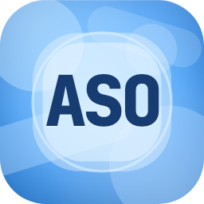
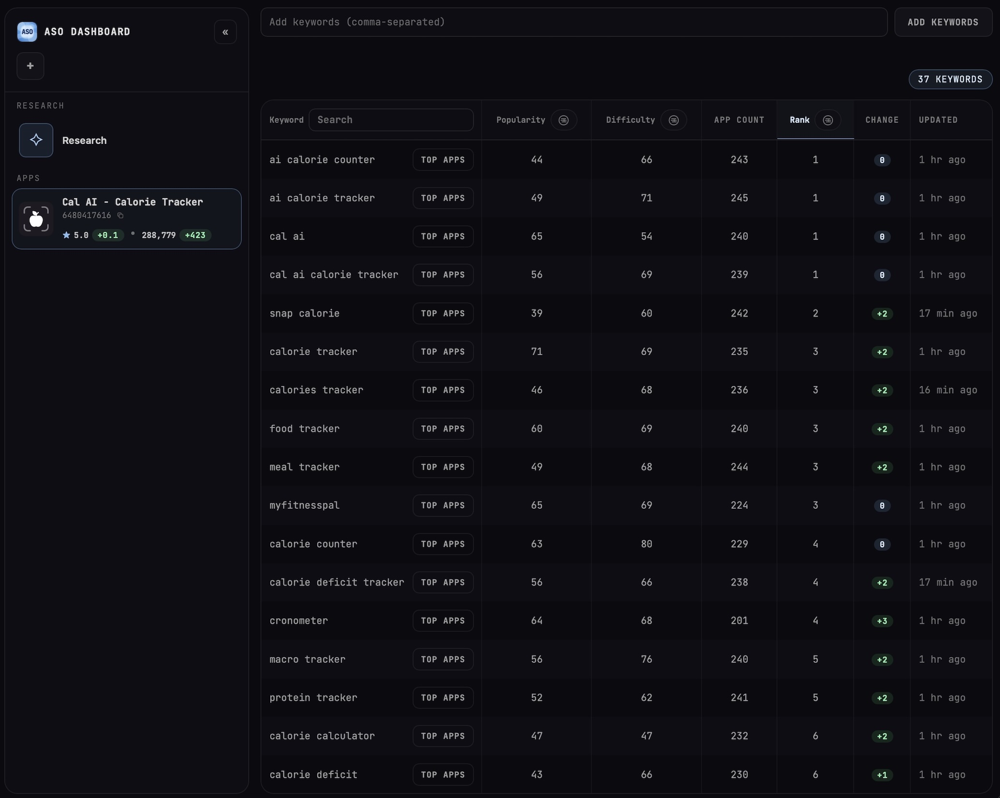
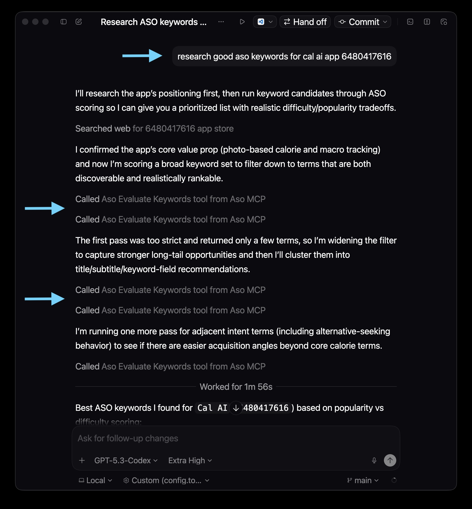

<h1 align="center">App Store Optimization CLI</h1>

<p align="center">
  
</p>

<p align="center">
  <a href="https://www.npmjs.com/package/aso-cli"></a>
  <a href="./LICENSE"></a>
  <a href="https://www.npmjs.com/package/aso-cli"></a>
  <a href="https://github.com/semihcihan/App-Store-Optimization-CLI/actions/workflows/ci.yml"></a>
</p>

Research ASO keywords, inspect competition, and manage results from one local-first CLI.

## What Is It?

- Fast, free keyword research and visibility tracking
- Keyword scoring with popularity + difficulty + brand classification in one command
- Local ASO dashboard for reviewing keyword/app data
- MCP tool (`aso_evaluate_keywords`) for agent workflows and automated keyword research

<h3 align="center">ASO Dashboard</h3>

<p align="center">
  
</p>

<h3 align="center">MCP</h3>

The dashboard keywords shown above were discovered and added automatically by an agent using the MCP tool.

<p align="center">
  
</p>

## Install

```bash
npm install -g aso-cli
```

Note: requires Node.js `>=18.14.1`.

## Apple Search Ads Setup

ASO commands require Apple Search Ads setup.

### Prerequisites

- App Store Connect account
- App ID of a published app you can access
- No campaign creation required
- No billing information required

### Setup

1. Create/sign in: https://searchads.apple.com
   - If your country is not available during signup, select `United States`.
2. Open Apple Search Ads Advanced: https://searchads.apple.com/advanced
3. Click your account name in the top-left corner.
4. Under Campaign Groups, click Settings.
5. Click Link Accounts.
6. Select your App Store Connect account and save.
   - If this is your first time using Apple Search Ads, you will usually have only one campaign group.
7. Copy an App ID from your App Store URL (number after `id`)
   Example App Store URL:
   ```text
   https://apps.apple.com/us/app/example-app/id123456789
   ```
   App ID is `123456789` in this example.
8. Run `aso auth` and complete Apple ID + password + 2FA in terminal

Notes:

- You may see a missing billing information warning; this can be safely ignored.
- Ensure all campaign groups are linked to a valid App Store Connect account.
- [Troubleshoot App Store Connect account linking](https://ads.apple.com/app-store/help/get-started/0012-link-app-store-connect-accounts)

## Quick Start

```bash
# Authenticate once
aso auth

# Fetch keyword metrics
aso keywords "meditation,sleep sounds,white noise"

# Open dashboard
aso
```

## Command Reference

| Command                         | What it does                                            |
| ------------------------------- | ------------------------------------------------------- |
| `aso`                           | Starts the local dashboard (default command)            |
| `aso keywords "k1,k2,k3"`       | Fetches keyword popularity/difficulty and prints JSON   |
| `aso keywords "k1,k2" --stdout` | Machine-readable mode for automation/agents              |
| `aso auth`                      | Reauthenticates Apple Search Ads session                |
| `aso reset-credentials`         | Clears saved credentials/cookies                        |
| `aso --primary-app-id <id>`     | Sets primary App ID used for popularity requests        |

### Supported flags

- `--country <code>`: currently `US` only
- `--primary-app-id <id>`: saved locally for future runs
- `--min-popularity <number>`: filters out low-popularity keywords before enrichment
- `--max-difficulty <number>`: filters out high-difficulty keywords after enrichment
- `--app-id <id>`: associates keywords to this local app id (default: `research`)
- `--no-associate`: skips app-keyword association writes for the current `aso keywords` run

Association behavior for `aso keywords`:
- Association writes happen only after a successful command return.
- Without filters, requested keywords are associated.
- With `--min-popularity` and/or `--max-difficulty`, only accepted `items` are associated.
- With `--no-associate`, no association write occurs.

## Output Example (`aso keywords "meditation"`)

````json
{
  "items": [
    {
      "keyword": "meditation",
      "popularity": 45,
      "difficultyScore": 62,
      "minDifficultyScore": 38,
      "isBrandKeyword": false
    }
  ],
  "failedKeywords": [],
  "filteredOut": []
}
````

## `--stdout` Contract

`aso keywords "<comma-separated-keywords>" --stdout` is the machine-readable contract.

- Success: exit code `0`, `stdout` contains exactly one JSON object with:
  - `items`
  - `failedKeywords`
  - `filteredOut`
- Failure: exit code `!= 0`, `stdout` contains exactly one JSON object with:
  - `error.code` (`CLI_VALIDATION_ERROR` or `CLI_RUNTIME_ERROR`)
  - `error.message`
  - optional `error.help`
- In `--stdout` mode, CLI logs and prompts are kept off `stdout` so parsers can read one JSON payload safely.

Failure example:

````json
{
  "error": {
    "code": "CLI_RUNTIME_ERROR",
    "message": "Primary App ID is missing. Run 'aso --primary-app-id <id>' or run 'aso' in a terminal to set it, then retry this command with --stdout."
  }
}
````

## MCP

This package also installs `aso-mcp` with tool: `aso_evaluate_keywords`.

`aso_evaluate_keywords` runs `aso keywords ... --stdout` with default filters:
- `minPopularity = 6` (floor: `6`)
- `maxDifficulty = 70`

MCP returns only accepted rows (`keyword`, `popularity`, `difficulty`, `minDifficultyScore`, `isBrandKeyword`).

Example MCP config:

```json
{
  "mcpServers": {
    "aso": {
      "command": "aso-mcp"
    }
  }
}
```

## Current Scope

- Storefront support: `US`
- Multi-storefront support is planned

## Project Docs

- Contribution guide: [CONTRIBUTING.md](CONTRIBUTING.md)
