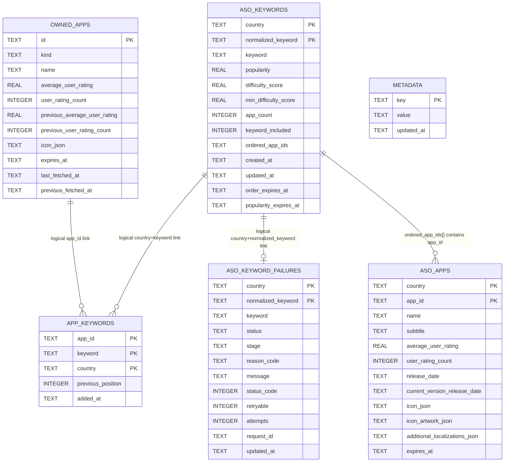

# ASO Local SQLite Schema

## Scope
Canonical schema for local SQLite docs in `~/.aso/aso-db.sqlite` (or `ASO_DB_PATH`).

## ER Diagram

## Table Schemas

### `owned_apps`
| Column | SQLite Type | TS Type | Nullable | Notes |
|---|---|---|---|---|
| `id` | `TEXT` | `string` | No | PK |
| `kind` | `TEXT` | `"owned" \| "research"` | No | `CHECK(kind IN ('owned','research'))` |
| `name` | `TEXT` | `string` | No | Display name |
| `average_user_rating` | `REAL` | `number \| null` | Yes | Current rating snapshot |
| `user_rating_count` | `INTEGER` | `number \| null` | Yes | Current rating-count snapshot |
| `previous_average_user_rating` | `REAL` | `number \| null` | Yes | Previous rating snapshot |
| `previous_user_rating_count` | `INTEGER` | `number \| null` | Yes | Previous rating-count snapshot |
| `icon_json` | `TEXT` | `Record<string, unknown> \| null` | Yes | JSON-encoded icon payload |
| `expires_at` | `TEXT` | `string \| null` | Yes | ISO datetime TTL |
| `last_fetched_at` | `TEXT` | `string \| null` | Yes | ISO datetime latest owned-app fetch |
| `previous_fetched_at` | `TEXT` | `string \| null` | Yes | ISO datetime previous fetch |

Indexes:
- PK: (`id`)
- `idx_owned_apps_kind`: (`kind`)

### `aso_keywords`
| Column | SQLite Type | TS Type | Nullable | Notes |
|---|---|---|---|---|
| `country` | `TEXT` | `string` | No | PK part (`US`) |
| `normalized_keyword` | `TEXT` | `string` | No | PK part |
| `keyword` | `TEXT` | `string` | No | Display keyword |
| `popularity` | `REAL` | `number` | No | Search Ads popularity |
| `difficulty_score` | `REAL` | `number \| null` | Yes | Rounded integer semantics on write |
| `min_difficulty_score` | `REAL` | `number \| null` | Yes | Rounded integer semantics on write |
| `app_count` | `INTEGER` | `number \| null` | Yes | Ordered app count |
| `keyword_included` | `INTEGER` | `number \| null` | Yes | Inclusion signal count |
| `ordered_app_ids` | `TEXT` | `string[]` | No | JSON-encoded app id list |
| `created_at` | `TEXT` | `string` | No | ISO datetime |
| `updated_at` | `TEXT` | `string` | No | ISO datetime |
| `order_expires_at` | `TEXT` | `string` | No | Order TTL |
| `popularity_expires_at` | `TEXT` | `string` | No | Popularity/difficulty TTL |

Indexes:
- PK: (`country`, `normalized_keyword`)
- `idx_aso_keywords_country_order_expires`: (`country`, `order_expires_at`)

### `aso_apps`
Competitor app-doc cache only (country-scoped).

| Column | SQLite Type | TS Type | Nullable | Notes |
|---|---|---|---|---|
| `country` | `TEXT` | `string` | No | PK part |
| `app_id` | `TEXT` | `string` | No | PK part |
| `name` | `TEXT` | `string` | No | App name |
| `subtitle` | `TEXT` | `string \| null` | Yes | App subtitle |
| `average_user_rating` | `REAL` | `number` | No | Rating |
| `user_rating_count` | `INTEGER` | `number` | No | Rating count |
| `release_date` | `TEXT` | `string \| null` | Yes | Release date |
| `current_version_release_date` | `TEXT` | `string \| null` | Yes | Current version release date |
| `icon_json` | `TEXT` | `Record<string, unknown> \| null` | Yes | JSON-encoded icon payload |
| `icon_artwork_json` | `TEXT` | `Record<string, unknown> \| null` | Yes | JSON-encoded icon artwork payload |
| `additional_localizations_json` | `TEXT` | `Record<string, { title: string; subtitle?: string }> \| null` | Yes | JSON-encoded locale map used for keyword inclusion/difficulty matching (non-default locales) |
| `expires_at` | `TEXT` | `string \| null` | Yes | ISO datetime TTL |

Indexes:
- PK: (`country`, `app_id`)

### `app_keywords`
| Column | SQLite Type | TS Type | Nullable | Notes |
|---|---|---|---|---|
| `app_id` | `TEXT` | `string` | No | PK part; logical link to `owned_apps.id` |
| `keyword` | `TEXT` | `string` | No | PK part; normalized keyword |
| `country` | `TEXT` | `string` | No | PK part |
| `previous_position` | `INTEGER` | `number \| null` | Yes | Rank delta baseline |
| `added_at` | `TEXT` | `string \| null` | Yes | Association timestamp |

Indexes:
- PK: (`app_id`, `keyword`, `country`)
- `idx_app_keywords_country_app`: (`country`, `app_id`)
- `idx_app_keywords_country_keyword`: (`country`, `keyword`)

### `metadata`
| Column | SQLite Type | TS Type | Nullable | Notes |
|---|---|---|---|---|
| `key` | `TEXT` | `string` | No | PK |
| `value` | `TEXT` | `string` | No | Metadata value |
| `updated_at` | `TEXT` | `string` | No | ISO datetime |

Known runtime key:
- `aso-popularity-adam-id`

### `aso_keyword_failures`
| Column | SQLite Type | TS Type | Nullable | Notes |
|---|---|---|---|---|
| `country` | `TEXT` | `string` | No | PK part |
| `normalized_keyword` | `TEXT` | `string` | No | PK part |
| `keyword` | `TEXT` | `string` | No | Normalized keyword |
| `status` | `TEXT` | `"failed"` | No | Terminal status |
| `stage` | `TEXT` | `"popularity" \| "enrichment"` | No | Failure stage |
| `reason_code` | `TEXT` | `string` | No | Normalized reason |
| `message` | `TEXT` | `string` | No | User/debug message |
| `status_code` | `INTEGER` | `number \| null` | Yes | Upstream/HTTP status |
| `retryable` | `INTEGER` | `boolean` | No | `1` retryable, `0` non-retryable |
| `attempts` | `INTEGER` | `number` | No | Attempt count |
| `request_id` | `TEXT` | `string \| null` | Yes | Upstream request id |
| `updated_at` | `TEXT` | `string` | No | ISO datetime |

Indexes:
- PK: (`country`, `normalized_keyword`)
- `idx_aso_keyword_failures_country_stage`: (`country`, `stage`)

## Notes
- DB init applies `PRAGMA journal_mode = WAL` and `PRAGMA foreign_keys = ON`.
- There are no foreign-key constraints between ASO tables; links are logical and enforced at service layer.
